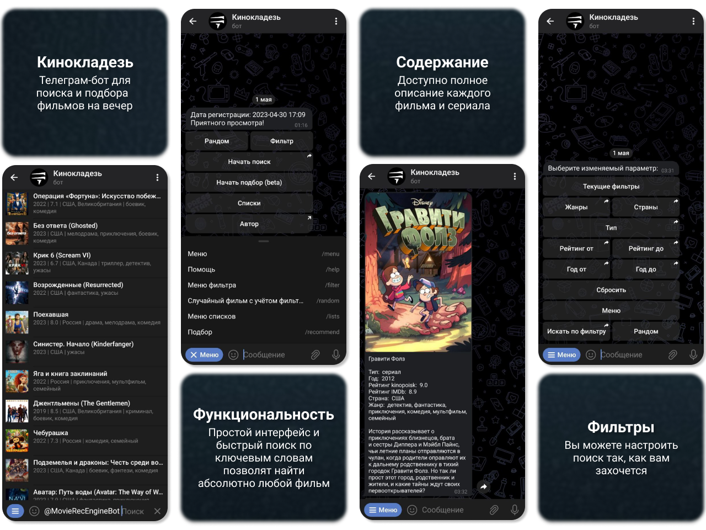

# [Кинокладезь](https://t.me/MovieRecEngineBot)

Телеграм-бот, предназначенный для поиска и подбора фильмов

## Главные преимущества:

> - Функциональность: простой интерфейс и быстрый поиск по ключевым словам позволят найти абсолютно любой фильм;
> - Содержание: доступно полное описание каждого фильма и сериала;
> - Фильтры: вы можете настроить поиск так, как вам захочется.

## Основные возможности

> - Поиск по ключевым словам
> - Поиск по фильтрам
> - Случайный фильм
> - Отображение фильма и основных данных о нём
> - Добавление фильма в списки: избранное, понравившиеся, непонравившиеся, ожидающие просмотра

## Особенности

* Взаимодействие с [*API кинопоиска*](https://kinopoiskapiunofficial.tech/)

## Функционал

| Команда     | Описание                           |
|-------------|------------------------------------|
| /menu       | Меню                               |
| /help       | Помощь                             |
| /filter     | Меню фильтра                       |
| /random     | Случайный фильм с учётом фильтров  |
| /lists      | Открыть меню списков               |
| /recommend  | Начать подбор                      |

## Зависимости

* kinopoisk_api_unofficial_client
* python-telegram-bot
* SQLAlchemy

## Описание работы и структуры проекта

[Смотреть description.md](description.md)